<strong>Repository ini dibuat untuk memenuhi tugas Pemrograman Web</strong>
| <strong>Nama</strong>      | <strong>Riris Naomi Gurning</strong>  |
| ----------- | -----------  |
| <strong>NIM</strong>       | <strong>312010190</strong>            |
| <strong>Kelas</strong>     | <strong>TI.20.A.1</strong>            |

# Praktikum 11: PHP Framework (Codeigniter)
# <b>Langkah-langkah Praktikum</b>
Sebelum memulai menggunakan Framework Codeigniter, perlu dilakukan konfigurasi pada webserver. Beberapa ekstensi PHP perlu diaktifkan untuk kebutuhan
pengembangan Codeigniter 4.
Berikut beberapa ekstensi yang perlu diaktifkan:
<br>• <b>php-json</b> ekstension untuk bekerja dengan JSON;<br>
• <b>php-mysqlnd</b> native driver untuk MySQL;
<br>• <b>php-xml</b> ekstension untuk bekerja dengan XML;</br>
• <b>php-intl</b> ekstensi untuk membuat aplikasi multibahasa;
<br>• <b>libcurl</b> (opsional), jika ingin pakai Curl. Untuk mengaktifkan ekstentsi tersebut,</br>
<p>Untuk mengaktifkan ekstentsi tersebut, melalu <b>XAMPP Control Panel</b>, pada bagian Apache klik <b>Config -> PHP.ini</b></p>

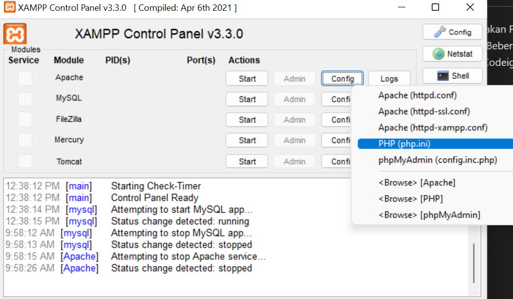

<p>Setelah klik PHP(php.ini), pada bagian extention, hilangkan tanda ; (titik koma) pada ekstensi yang akan
diaktifkan. Kemudian simpan kembali filenya dan restart Apache web server.

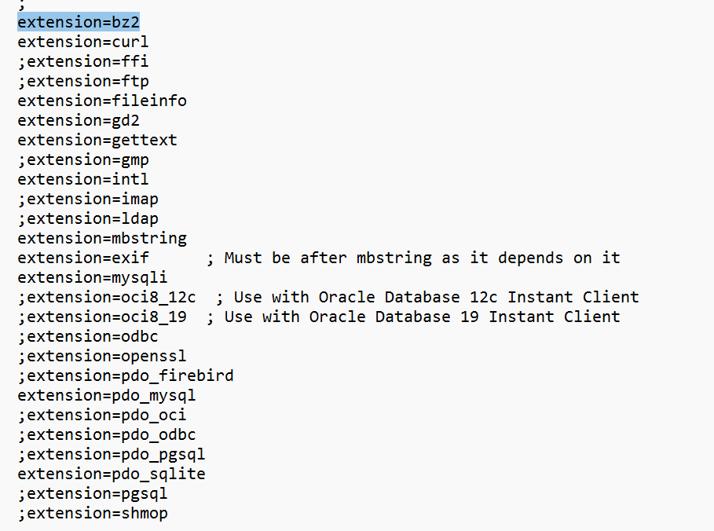

## Instalasi Codeigniter 4
Untuk melakukan instalasi Codeigniter 4 dapat dilakukan dengan dua cara, yaitu cara
manual dan menggunakan <b>composer</b>. Pada praktikum ini kita menggunakan cara
manual.
<br>• Unduh <b>Codeigniter</b> dari website https://codeigniter.com/download</br>
• Extrak file zip Codeigniter ke direktori <b>htdocs/lab11_php_ci</b>.
<br>• Ubah nama direktory <b>framework-4.x.xx</b> menjadi <b>ci4</b>.</br>
• Buka browser dengan alamat http://localhost/lab11_php_ci/ci4/public/
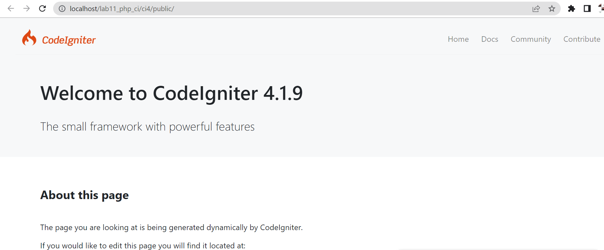

## Menjalankan CLI (Command Line Interface)
Codeigniter 4 menyediakan CLI untuk mempermudah proses development. Untuk mengakses CLI buka terminal/command prompt.
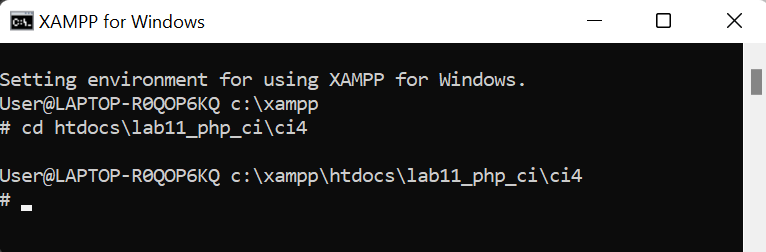

Arahkan lokasi direktori sesuai dengan direktori kerja project dibuat (xampp/<b>htdocs/lab11_ci/ci4/</b>) <p>Setelah itu kita memanggil CLI Codeigniter dengan menjalankan perintah:</p>
```
php spark
```
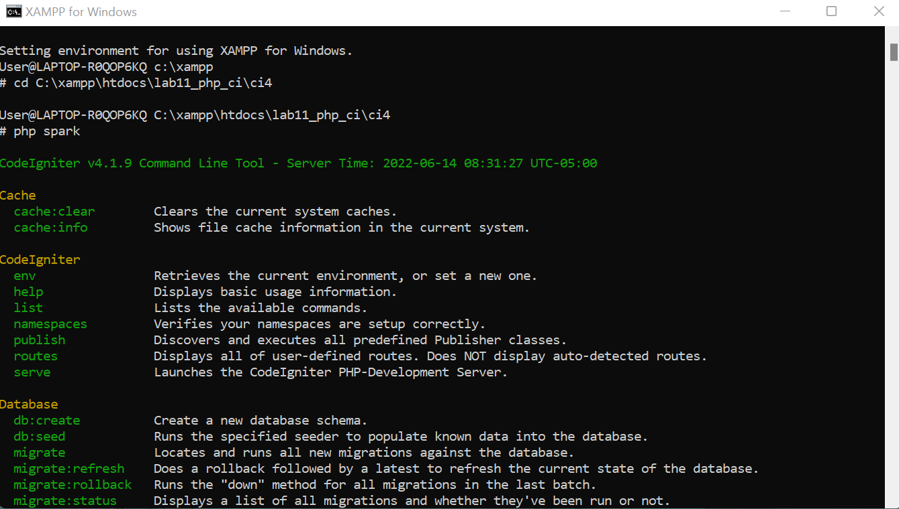

## Mengaktifkan Mode Debugging
Codeigniter 4 menyediakan fitur debugging untuk memudahkan developer untuk
mengetahui pesan error apabila terjadi kesalahan dalam membuat kode program.
<p>Secara default fitur ini belum aktif. Ketika terjadi error pada aplikasi akan ditampilkan pesan kesalahan seperti berikut.</p>

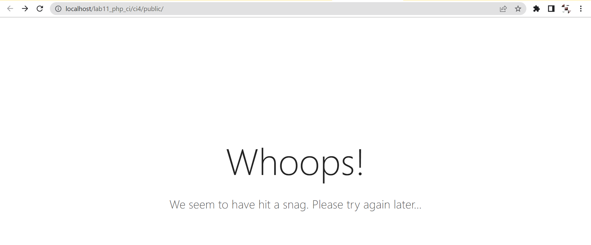

<p>Semua jenis error akan ditampilkan sama. Untuk memudahkan mengetahui jenis errornya, maka perlu diaktifkan mode debugging dengan mengubah nilai konfigurasi pada environment variable <b>CI_ENVIRINMENT</b> menjadi <b>development</b>.</p>

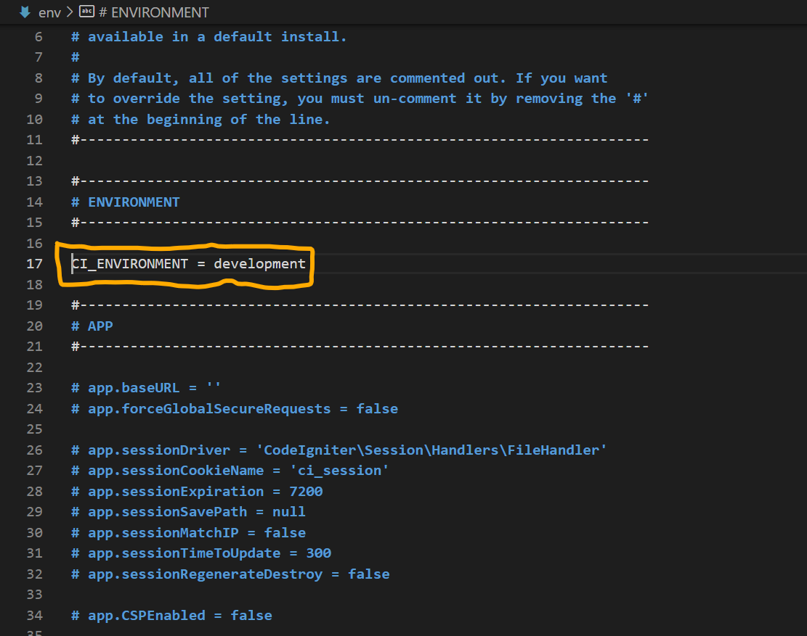

Ubah nama file env menjadi .env kemudian buka file tersebut dan ubah nilai variable
<b>CI_ENVIRINMENT</b> menjadi <b>development.</b>

<p>Contoh error yang terjadi. Untuk mencoba error tersebut, ubah kode pada file <b>app/Controller/Home.php</b> hilangkan titik koma pada akhir kode.

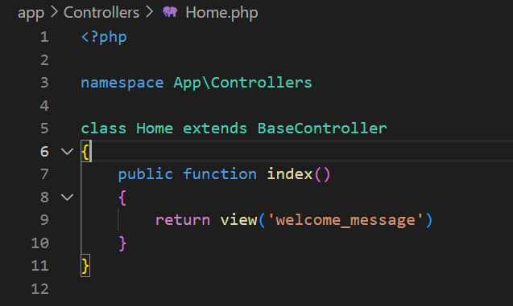
<br>Dan inilah Hasilnya</br>
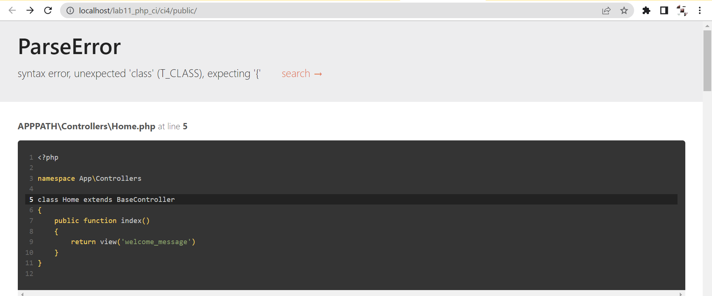

## Struktur Direktori
Untuk lebih memahami Framework Codeigniter 4 perlu mengetahui struktur direktori
dan file yang ada. Buka pada Windows Explorer atau dari Visual Studio Code ->
Open Folder.
Terdapat beberapa direktori dan file yang perlu dipahami fungsi dan kegunaannya.
<br>• <b>.github</b> folder ini kita butuhkan untuk konfigurasi repo github, seperti konfigurasi untuk build dengan github action;</br>
• <b>app</b> folder ini akan berisi kode dari aplikasi yang kita kembangkan;
<br>• <b>public</b> folder ini berisi file yang bisa diakses oleh publik, seperti file index.php,</br>
robots.txt, favicon.ico, ads.txt, dll;
<br>• <b>tests</b> folder ini berisi kode untuk melakukan testing dengna PHPunit;</br>
• <b>vendor</b> folder ini berisi library yang dibutuhkan oleh aplikasi, isinya juga termasuk
kode core dari system CI.
<br>• <b>writable</b> folder ini berisi file yang ditulis oleh aplikasi. Nantinya, kita bisa pakai untuk menyimpan file yang di-upload, logs, session, dll.
Sedangkan file-file yang berada pada root direktori CI sebagai berikut.<br>
• <b>.env</b> adalah file yang berisi variabel environment yang dibutuhkan oleh aplikasi.
<br>• <b>.gitignore</b> adalah file yang berisi daftar nama file dan folder yang akan diabaikan oleh Git.</br>
• <b>build</b> adalah script untuk mengubah versi codeigniter yang digunakan. Ada versi
release (stabil) dan development (labil).
<br>• <b>composer.json</b> adalah file JSON yang berisi informasi tentang proyek dan daftar library yang dibutuhkannya. File ini digunakan oleh Composer sebagai acuan.</br>
• <b>composer.lock</b> adalah file yang berisi informasi versi dari libraray yang digunakan
aplikasi.
<br>• <b>license.txt</b> adalah file yang berisi penjelasan tentang lisensi Codeigniter;</br>
• <b>phpunit.xml.dist</b> adalah file XML yang berisi konfigurasi untuk PHPunit.
• <b>README.md</b> adalah file keterangan tentang codebase CI. Ini biasanya akan
dibutuhkan pada repo github atau gitlab.
<br>• <b>spark</b> adalah program atau script yang berfungsi untuk menjalankan server, generate kode, dll.</br>
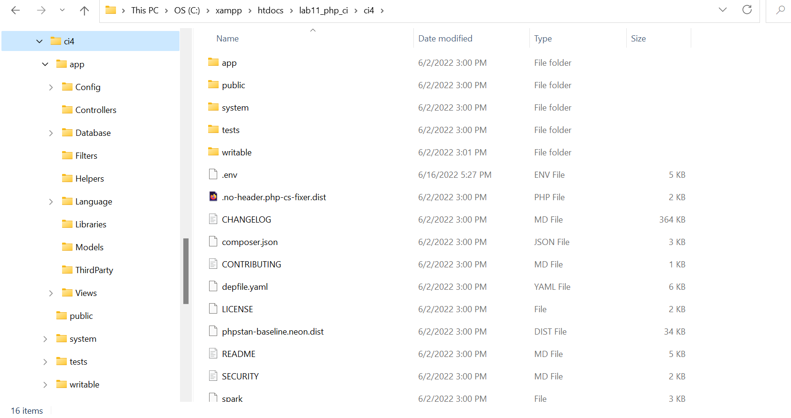
<p>Fokus kita pada folder <b>app</b>, dimana folder tersebut adalah area kerja kita untuk
membuat aplikasi. Dan folder <b>public</b> untuk menyimpan aset web seperti css, gambar,
javascript, dll.</p>

## Memahami Konsep MVC
Codeigniter menggunakan konsep MVC. MVC meripakan singkatan dari *Model-View-Controller*. MVC merupakan konsep arsitektur yang umum digunakan
dalam pengembangan aplikasi. Konsep MVC adalah memisahkan kode program
berdasarkan logic proses, data, dan tampilan. Untuk logic proses diletakkan pada
direktori Contoller, Objek data diletakkan pada direktori Model, dan desain tampilan
diletakkan pada direktori View.

<p>Codeigniter menggunakan konsep pemrograman berorientasi objek dalam
mengimplementasikan konsep MVC.</p>

<p><b>Model</b> merupakan kode program yang berisi pemodelan data. Data dapat berupa database ataupun sumber lainnya.</p>

<p><b>View</b> merupakan kode program yang berisi bagian yang menangani terkait tampilan user interface sebuah aplikasi. didalam aplikasi web biasanya pasti akan berhubungan
dengan html dan css.</p>

<p><b>Controller</b> merupakaan kode program yang berkaitan dengan logic proses yang menghubungkan antara view dan model Controller berfungsi untuk menerima request dan data dari user kemudian diproses dengan menghubungkan bagian model dan view.</p>

<p><b>Routing dan Controller</b>
<br>Routing merupakan proses yang mengatur arah atau rute dari request untuk menentukan
fungsi/bagian mana yang akan memproses request tersebut. Pada framework CI4, routing bertujuan untuk menentukan Controller mana yang harus merespon sebuah request. Controller adalah class atau script yang bertanggung jawab merespon sebuah
request.</p>
<p>Pada Codeigniter, request yang diterima oleh file index.php akan diarahkan ke Router untuk meudian oleh router tesebut diarahkan ke Controller.</p>
Router terletak pada file <b>app/config/Routes.php</b>

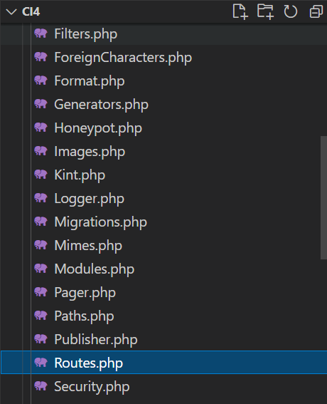

Pada file tersebut kita dapat mendefinisikan route untuk aplikasi yang kita buat.
Contoh:
```php
$routes->get('/', 'Home::index');
```
Kode tersebut akan mengarahkan rute untuk halaman home.
## Membuat Route Baru.
Tambahkan kode berikut di dalam <b>Routes.php</b>
```php
$routes->get('/about', 'Page::about');
$routes->get('/contact', 'Page::contact');
$routes->get('/faqs', 'Page::faqs');
```
Untuk mengetahui route yang ditambahkan sudah benar, buka CLI dan jalankan perintah berikut.
```php
php spark routes
```
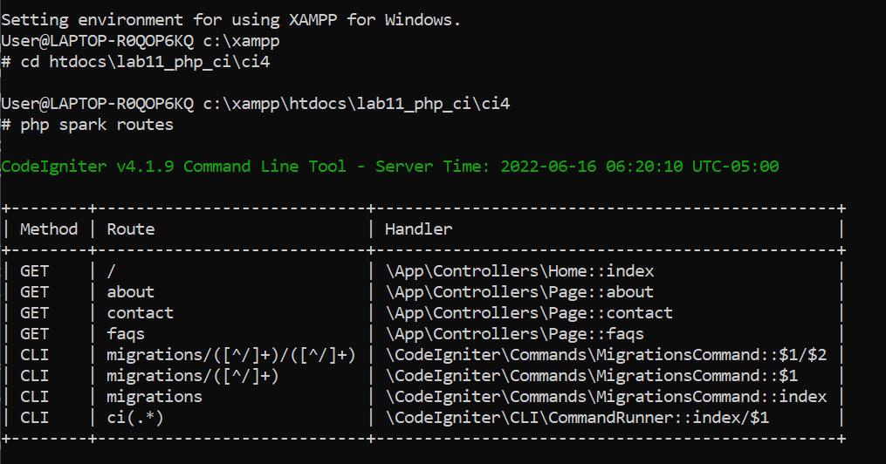

Selanjutnya coba akses route yang telah dibuat dengan mengakses alamat url
http://localhost/lab11_php_ci/ci4/public/about

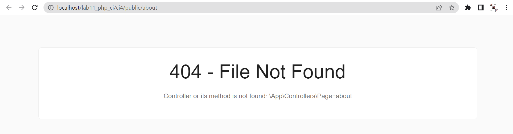

<p>Ketika diakses akan mucul tampilan error 404 file not found, itu artinya file/page tersebut tidak ada. Untuk dapat mengakses halaman tersebut, harus dibuat terlebih
dahulu Contoller yang sesuai dengan routing yang dibuat yaitu Contoller Page.</p>

## Membuat Controller
Selanjutnya adalah membuat Controller Page. Buat file baru dengan nama <b>page.php</b> pada direktori Controller kemudian isi kodenya seperti berikut.
```php
<?php

namespace App\Controllers;

class Page extends BaseController
{
    public function about()
    {
        echo "Ini halaman About";
    }
    
    public function contact()
    {
        echo "Ini halaman Contact";
    }
    
    public function faqs()
    {
        echo "Ini halaman FAQ";
    }
}
```
Selanjutnya refresh Kembali browser http://localhost/lab11_php_ci/ci4/public/page/about , maka akan ditampilkan hasilnya yaitu halaman sudah dapat diakses.
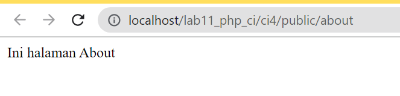

## Auto Routing
Secara default fitur autoroute pada Codeiginiter sudah aktif. Untuk mengubah status autoroute dapat mengubah nilai variabelnya. Untuk menonaktifkan ubah nilai true menjadi <b>false</b>.
```php
$routes->setAutoRoute(true);
```
Tambahkan method baru pada Controller Page seperti berikut.
```php
public function tos()
{
    echo "ini halaman Term of Services";
}
```
Method ini belum ada pada routing, sehingga cara mengaksesnya dengan menggunakan
alamat: http://localhost/lab11_php_ci/ci4/public/page/tos
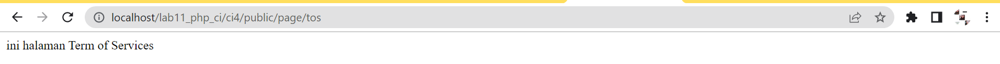

## Membuat View
Selanjutnya adalam membuat view untuk tampilan web agar lebih menarik. Buat file
baru dengan nama about.php pada direktori view (<b>app/view/about.php</b>) kemudian isi
kodenya seperti berikut.
```php
<!DOCTYPE html>
<html lang="en">
<head>
    <meta charset="UTF-8">
    <title><?= $title; ?></title>
</head>
<body>
    <h1><?= $title; ?></h1>
    <hr>
    <p><?= $content; ?></p>
</body>
</html>
```
Ubah method about pada class Controller Page menjadi seperti berikut:
```php
public function about()
{
    return view('about', [
        'title' => 'Halaman Abot',
        'content' => 'Ini adalah halaman abaut yang menjelaskan tentang isi
halaman ini.'
    ]);
}
```
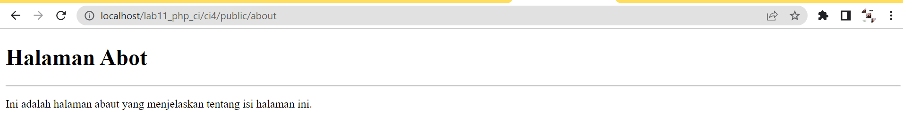

## Membuat Layout Web dengan CSS
Pada dasarnya layout web dengan css dapat diimplamentasikan dengan mudah pada codeigniter. Yang perlu diketahui adalah, pada Codeigniter 4 file yang menyimpan asset css dan javascript terletak pada direktori public.

<p>Buat file css pada direktori public dengan nama style.css (copy file dari praktikum lab4_layout. Kita akan gunakan layout yang pernah dibuat pada praktikum 4.</p>

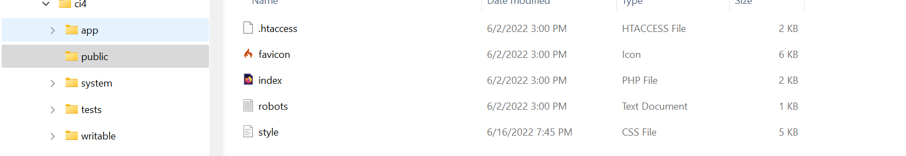
Kemudian buat folder <b>template</b> pada direktori <b>view</b> kemudian buat file <b>header.php</b> dan <b>footer.php</b>

File <b>app/view/template/header.php</b>
```php
<!DOCTYPE html>
<html lang="en">
  <link
    rel="stylesheet"
    href="https://cdn.jsdelivr.net/npm/bootstrap@4.0.0/dist/css/bootstrap.min.css"
    integrity="sha384-Gn5384xqQ1aoWXA+058RXPxPg6fy4IWvTNh0E263XmFcJlSAwiGgFAW/dAiS6JXm"
    crossorigin="anonymous"
  />
  <head>
    <meta charset="UTF-8" />
    <title><?= $title; ?></title>
    <link rel="stylesheet" href="style.css" />
  </head>

  <body>
    <div id="container">
      <header>
        <h1>Layout Sederhana</h1>
      </header>
      <nav>
        <a href="<?= base_url('/'); ?>" class="active">Home</a>
        <a href="<?= base_url('/artikel'); ?>">Artikel</a>
        <a href="<?= base_url('/about'); ?>">About</a>
        <a href="<?= base_url('/contact'); ?>">Kontak</a>
      </nav>
      <section id="wrapper">
        <section id="main"></section>
```
File <b>app/view/template/footer.php</b>
```php 
        </section>
        <aside id="sidebar">
            <div class="widget-box">
                <h3 class="title">Widget Header</h3>
                <ul>
                    <li><a href="#">Widget Link</a></li>
                    <li><a href="#">Widget Link</a></li>
                </ul>
            </div>
            <div class="widget-box">
                <h3 class="title">Widget Text</h3>
                <p>Vestibulum lorem elit, iaculis in nisl volutpat, malesuada
                    tincidunt arcu. Proin in leo fringilla, vestibulum mi porta, faucibus felis.
                    Integer pharetra est nunc, nec pretium nunc pretium ac.</p>
            </div>
        </aside>
    </section>
    <footer>
        <p>&copy; 2022 - <i>riris</i>  </p>
    </footer>
    </div>
</body>
</html>
```
Kemudian ubah file <b>app/view/about.php</b> seperti berikut.
```php
<?= $this->include('template/header'); ?>

<h1><?= $title; ?></h1>
<hr>
<p><?= $content; ?></p>

<?= $this->include('template/footer'); ?>
```
Selanjutnya refresh tampilan pada alamat http://localhost/lab11_php_ci/ci4/public/about

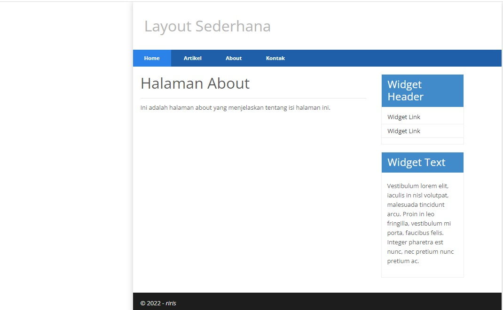

# Praktikum 12: Framework Lanjutan (CRUD)

## <b>Langkah-langkah Praktikum</b>
Untuk memulai membuat aplikasi CRUD sederhana, yang perlu disiapkan adalah
database server menggunakan MySQL. Pastikan MySQL Server sudah dapat dijalankan
melalui XAMPP.
```
Membuat Database
```
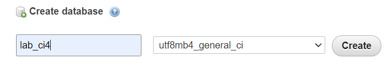
```
Membuat Tabel
```
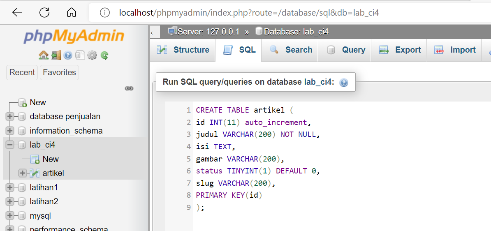

## <b> Konfigurasi koneksi database </b>
<p>Selanjutnya membuat konfigurasi untuk menghubungkan dengan database server.</p>
<p>Konfigurasi dapat dilakukan dengan du acara, yaitu pada file app/config/database.php atau menggunakan file .env. Pada praktikum ini kita gunakan konfigurasi pada file .env.</p>

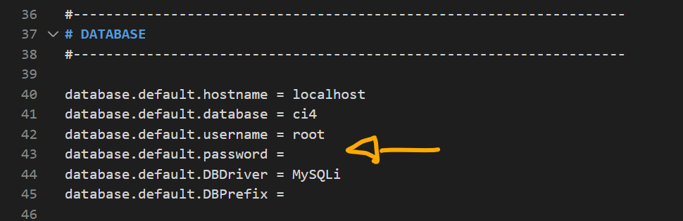

## <b> Membuat Model </b>
Selanjutnya adalah membuat Model untuk memproses data Artikel. Buat file baru pada
direktori ```app/Models``` dengan nama ``` ArtikelModel.php ```
```php
<?php

namespace App\Models;

use CodeIgniter\Model;

class ArtikelModel extends Model
{
    protected $table = 'artikel';
    protected $primaryKey = 'id';
    protected $useAutoIncrement = true;
    protected $allowedFields = ['judul', 'isi', 'status', 'slug', 'gambar'];
}
```
<p>ini tampilan di VSC</p>

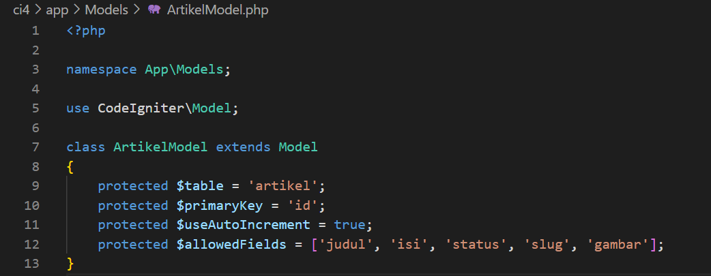

## <b> Membuat Controller </b>
Buat Controller baru dengan nama ```Artikel.php``` pada direktori ```app/Controllers```.
```php
<?php
namespace App\Controllers;
use App\Models\ArtikelModel;
class Artikel extends BaseController
{
    public function index()
    {
        $title = 'Daftar Artikel';
        $model = new ArtikelModel();
        $artikel = $model->findAll();
        return view('artikel/index', compact('artikel', 'title'));
    }
}
```
<p>ini tampilan di VSC</p>

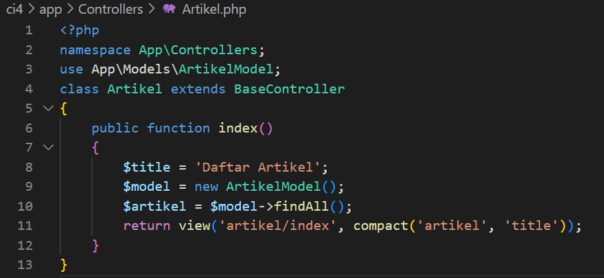

## <b> Membuat View </b>
Buat direktori baru dengan nama artikel pada direktori app/views, kemudian buat file
baru dengan nama ```index.php```.
```php
<?= $this->include('template/header'); ?>

<?php if($artikel): foreach($artikel as $row): ?>
<article class="entry">
    <h2<a href="<?= base_url('/artikel/' . $row['slug']);?>"><?=
    $row['judul']; ?></a>
    </h2>
    " alt="<?=
    $row['judul']; ?>">
    <p><?= substr($row['isi'], 0, 200); ?></p>
</article>
<hr class="divider" />
<?php endforeach; else: ?>
<article class="entry">
    <h2>Belum ada data.</h2>
</article>
<?php endif; ?>

<?= $this->include('template/footer'); ?>
```
<p>ini tampilan di VSC</p>

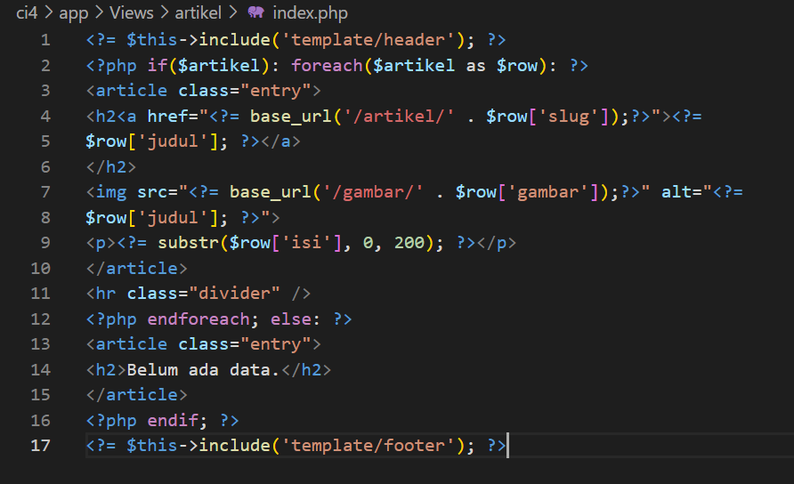

Selanjutnya buka browser kembali, dengan mengakses url http://localhost:8080/artikel

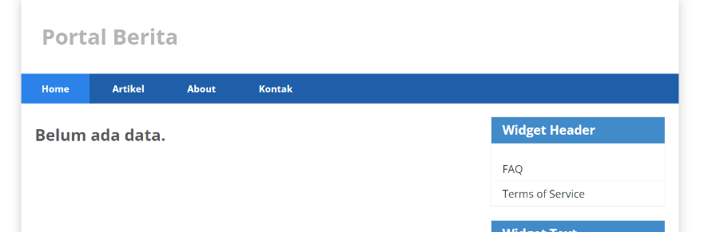

Belum ada data yang diampilkan. Kemudian coba tambahkan beberapa data pada
database agar dapat ditampilkan datanya.
```php
INSERT INTO artikel (judul, isi, slug) VALUE
('Artikel pertama', 'Lorem Ipsum adalah contoh teks atau dummy dalam industri
percetakan dan penataan huruf atau typesetting. Lorem Ipsum telah menjadi
standar contoh teks sejak tahun 1500an, saat seorang tukang cetak yang tidak
dikenal mengambil sebuah kumpulan teks dan mengacaknya untuk menjadi sebuah
buku contoh huruf.', 'artikel-pertama'),
('Artikel kedua', 'Tidak seperti anggapan banyak orang, Lorem Ipsum bukanlah
teks-teks yang diacak. Ia berakar dari sebuah naskah sastra latin klasik dari
era 45 sebelum masehi, hingga bisa dipastikan usianya telah mencapai lebih
dari 2000 tahun.', 'artikel-kedua');
```
ini hasil di localhost myphpadmin

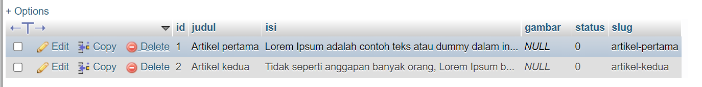

Refresh kembali browser, sehingga akan ditampilkan hasilnya.

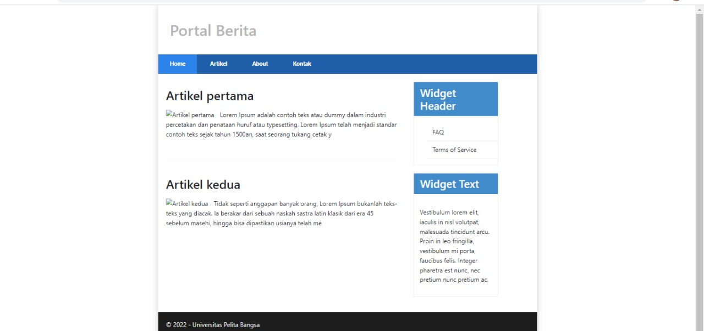

## <b> Membuat Tampilan Detail Artikel </b>
Tampilan pada saat judul berita di klik maka akan diarahkan ke halaman yang berbeda.
Tambahkan fungsi baru pada Controller Artikel dengan nama view().
```php
public function view($slug)
{
    $model = new ArtikelModel();
    $artikel = $model->where([
        'slug' => $slug
    ])->first();

    // Menampilkan error apabila data tidak ada.
    if (!$artikel)
    {
        throw PageNotFoundException::forPageNotFound();
    }
    $title = $artikel['judul'];
    return view('artikel/detail', compact('artikel', 'title'));
}
```
## <b> Membuat View Detail </b>
Buat view baru untuk halaman detail dengan nama <b>``` app/views/artikel/detail.php ```.</b>
```php
<?= $this->include('template/header'); ?>

<article class="entry">
    <h2><?= $artikel['judul']; ?></h2>
    " alt="<?=
$artikel['judul']; ?>">
    <p><?= $row['isi']; ?></p>
</article>

<?= $this->include('template/footer'); ?>
```

## <b> Membuat Routing untuk artikel detail </b>
Buka Kembali file ``` app/config/Routes.php ```, kemudian tambahkan routing untuk artikel
detail.
```php
$routes->get('/artikel/(:any)', 'Artikel::view/$1');
```


# Membuat Menu Admin
Terletak di folder <strong> ```php app/Controller```, </strong> edit file <strong> ```php Artikel.php```.</strong> Tambah method <strong> ```php admin_index()```.</strong>

```php
public function ```php admin_index()```
{
$title = 'Daftar Artikel';
$model = new ArtikelModel();
$artikel = $model->findAll();
return view('artikel/admin_index', compact('artikel', 'title'));
}
```


Selanjutnya buat view untuk tampilan admin dengan nama <strong> ```php admin_index.php``` </strong>

```php
<?= $this->include('template/admin_header'); ?>
<table class="table table-bordered table-hover">
    <thead>
        <tr class="table-primary">
            <th scope="col">ID</th>
            <th scope="col">Judul</th>
            <th scope="col">Status</th>
            <th scope="col">Aksi</th>
        </tr>
    </thead>
    <tbody>
        <?php if($artikel): foreach($artikel as $row): ?>
        <tr>
            <td><?= $row['id']; ?></td>
            <td>
                <b><?= $row['judul']; ?></b>
                <p><small><?= substr($row['isi'], 0, 50); ?></small></p>
            </td>
            <td><?= $row['status']; ?></td>
            <td>
                <a class="btn btn-primary p-1" href="<?= base_url('/admin/artikel/edit/' . 
                $row['id']);?>">Ubah</a>
                <a class="btn btn-danger p-1" onclick="return confirm('Yakin menghapus data?');" href="<?= base_url('/admin/artikel/delete/' . 
                $row['id']);?>">Hapus</a>
            </td>
        </tr>
        <?php endforeach; else: ?>
        <tr>
            <td colspan="4">Belum ada data.</td>
        </tr>
        <?php endif; ?>
    </tbody>
    <tfoot>
        <tr class="table-primary">
            <th scope="col">ID</th>
            <th scope="col">Judul</th>
            <th scope="col">Status</th>
            <th scope="col">Aksi</th>
        </tr>
    </tfoot>
</table>
<?= $this->include('template/admin_footer'); ?>
```

Buka folder yang ada di ```php app/Views/artikel/template```, kemudian buat:

```php admin_header.php```,
```php
<!DOCTYPE html>
<html lang="en">
    <head>
        <meta charset="UTF-8">
        <title><?= $title; ?></title>
        <!-- CSS only -->
        <link rel="stylesheet" href="<?= base_url('/style.css');?>">
        <link href="https://cdn.jsdelivr.net/npm/bootstrap@5.2.0-beta1/dist/css/bootstrap.min.css" rel="stylesheet" integrity="sha384-0evHe/X+R7YkIZDRvuzKMRqM+OrBnVFBL6DOitfPri4tjfHxaWutUpFmBp4vmVor" crossorigin="anonymous">
    </head>
    <body>
        <div id="container">
            <header>
                <h1>Admin Portal Berita</h1>
            </header>
            <nav>
                <a href="<?= base_url('/admin_index');?>" class="active">Dashboard</a>
                <a href="<?= base_url('/artikel');?>">Artikel</a>
                <a href="<?= base_url('/add');?>">Tambah Artikel</a>
            </nav>
            <section id="wrapper">
                <section id="main">
```

lalu buat juga <strong> admin_footer.php </strong> dilokasi yang sama dengan yang diatas.

 ```php
                </section>
            </section>
            <footer>
                <p>&copy; 2022 - Riris_Naomi</p>
            </footer>
        </div>
    </body>
</html>
```

Tambahkan routing untuk menu admin seperti berikut:

```php
$routes->group('admin', function($routes) {
  $routes->get('artikel', 'Artikel::admin_index');
  $routes->add('artikel/add', 'Artikel::add');
  $routes->add('artikel/edit/(:any)', 'Artikel::edit/$1');
  $routes->get('artikel/delete/(:any)', 'Artikel::delete/$1');
});
```


Akses menu admin dengan url http://localhost:8080/admin/artikel


# Menambah Data Artikel
Terletak di folder <strong> ```php app/Controller```,</strong> edit file <strong> ```php Artikel.php```.</strong> Tambah method add().
public function <strong> ```php add()``` </strong> 
 
```php
    {
        // validasi data.
        $validation = \Config\Services::validation();
        $validation->setRules(['judul' => 'required']);
        $isDataValid = $validation->withRequest($this->request)->run();
        if ($isDataValid)
        {
            $artikel = new ArtikelModel();
            $artikel->insert([
                'judul' => $this->request->getPost('judul'),
                'isi' => $this->request->getPost('isi'),
                'slug' => url_title($this->request->getPost('judul')),
            ]);
            return redirect('admin/artikel');
        }
        $title = "Tambah Artikel";
        return view('artikel/form_add', compact('title'));
    }
```
Akses kembali folder <strong> ```php app/Views/artikel```,</strong> buat file <strong> ```php form_add.php.``` </strong>

```php
<?= $this->include('template/admin_header'); ?>
<h2><?= $title; ?></h2>
<form action="" method="post">
    <p><input type="text" name="judul"></p>
    <p><textarea name="isi" cols="50" rows="10"></textarea></p>
    <p><input type="submit" value="Kirim" class="btn btn-large"></p>
</form>
<?= $this->include('template/admin_footer'); ?>
```
Akses browser dengan http://localhost:8080/admin/artikel/add.


# Mengubah Data Pada Artikel
Terletak di folder <strong> app/Controller,</strong> edit file <strong> Artikel.php.</strong> Tambah method <strong> edit(). </strong>

```php
public function edit($id) 
    {
        $artikel = new ArtikelModel();
        // validasi data.
        $validation = \Config\Services::validation();
        $validation->setRules(['judul' => 'required']);
        $isDataValid = $validation->withRequest($this->request)->run();
        if ($isDataValid)
        {
            $artikel->update($id, [
                'judul' => $this->request->getPost('judul'),
                'isi' => $this->request->getPost('isi'),
            ]);
            return redirect('admin/artikel');
        }
        
        // ambil data lama
        $data = $artikel->where('id', $id)->first();
        $title = "Edit Artikel";
        return view('artikel/form_edit', compact('title', 'data'));
    }
```

Akses kembali folder <strong> app/Views/artikel,<strong> buat file <strong> form_edit.php. </strong>

```php
<?= $this->include('template/admin_header'); ?>
<h2><?= $title; ?></h2>
<form action="" method="post">
    <p><input type="text" name="judul" value="<?= $data['judul'];?>" ></p>
    <p><textarea name="isi" cols="50" rows="10"><?=$data['isi'];?></textarea></p>
    <p><input type="submit" value="Kirim" class="btn btn-large"></p>
</form>
<?= $this->include('template/admin_footer'); ?>
```

Akses browser dengan http://localhost:8080/admin/artikel/edit/1 untuk Mengubah artikel pertama.

```php
<?= $this->include('template/admin_header'); ?>
<h2><?= $title; ?></h2>
<form action="" method="post">
    <p><input type="text" name="judul" value="<?= $data['judul'];?>" ></p>
    <p><textarea name="isi" cols="50" rows="10"><?=$data['isi'];?></textarea></p>
    <p><input type="submit" value="Kirim" class="btn btn-large"></p>
</form>
<?= $this->include('template/admin_footer'); ?>
```

# Menghapus Data Pada Artikel
Terletak di folder <strong> app/Controller,</strong> edit file <strong> Artikel.php.</strong> Tambah method <strong>delete().</strong>


Akses browser dengan http://localhost:8080/admin/artikel/add untuk membuat artikel ketiga, lalu kirim.


Untuk mengeceknya ketik di url, http://localhost:8080/artikel kemudian enter.


Pergi ke menu admin untuk menghapusnya, http://localhost:8080/admin/artikel, kemudian pilih hapus.


Artikel berhasil dihapus.


# Praktikum 13: Framework Lanjutan (Modul Login)
<strong> <p>Membuat Table User</p> </strong>

    ```php
    CREATE TABLE user (
    id INT(11) auto_increment,
    username VARCHAR(200) NOT NULL,
    useremail VARCHAR(200),
    userpassword VARCHAR(200),
    PRIMARY KEY(id)
    );
    ```


<strong> <p>Membuat Model User</p> </strong>
Selanjutnya adalah membuat Model untuk memproses data Login. Buat file baru pada direktori <strong>app/Models</strong> dengan nama <strong>UserModel.php</strong>

```php
<?php
namespace App\Models;
use CodeIgniter\Model;
class UserModel extends Model
{
    protected $table = 'user';
    protected $primaryKey = 'id';
    protected $useAutoIncrement = true;
    protected $allowedFields = ['username', 'useremail', 'userpassword'];
}
```

<strong> <p>Membuat Controller User</p> </strong>
Buat Controller baru dengan nama <strong>User.php</strong> pada direktori app/Controllers. Kemudian tambahkan method <strong>index()</strong> untuk menampilkan daftar user, dan method <strong>login()</strong> untuk proses login.

```php
<?php
namespace App\Controllers;
use App\Models\UserModel;
class User extends BaseController
{
    public function index()
    {
        $title = 'Daftar User';
        $model = new UserModel();
        $users = $model->findAll();
        return view('user/index', compact('users', 'title'));
    }
    public function login()
    {
        helper(['form']);
        $email = $this->request->getPost('email');
        $password = $this->request->getPost('password');
        if (!$email) {
            return view('user/login');
        }
        $session = session();
        $model = new UserModel();
        $login = $model->where('useremail', $email)->first();
        if ($login) {
            $pass = $login['userpassword'];
            if (password_verify($password, $pass)) {
                $login_data = [
                    'user_id' => $login['id'],
                    'user_name' => $login['username'],
                    'user_email' => $login['useremail'],
                    'logged_in' => TRUE,
                ];
                $session->set($login_data);
                return redirect('admin/artikel');
            } else {
                $session->setFlashdata("flash_msg", "Password salah.");
                return redirect()->to('/user/login');
            }
        } else {
            $session->setFlashdata("flash_msg", "email tidak terdaftar.");
            return redirect()->to('/user/login');
        }
    }
}
```

<strong> <p>Membuat View Login</p> </strong>
Buat direktori baru dengan nama user pada direktori <strong>app/views</strong>, kemudian buat file baru dengan nama <strong>login.php.</strong>

```php
<!DOCTYPE html>
<html lang="en">
<head>
    <meta charset="UTF-8">
    <title>Login</title>
    <link rel="stylesheet" href="<?= base_url('/style.css'); ?>">
</head>
<body>
    <div id="login-wrapper">
        <h1>Sign In</h1>
        <?php if (session()->getFlashdata('flash_msg')) : ?>
            <div class="alert alert-danger"><?=
                                            session()->getFlashdata('flash_msg') ?></div>
        <?php endif; ?>
        <form action="" method="post">
            <div class="mb-3">
                <label for="InputForEmail" class="form-label">Email
                    address</label>
                <input type="email" name="email" class="form-control" id="InputForEmail" value="<?= set_value('email') ?>">
            </div>
            <div class="mb-3">
                <label for="InputForPassword" class="form-label">Password</label>
                <input type="password" name="password" class="form-control" id="InputForPassword">
            </div>
            <button type="submit" class="btn
btn-primary">Login</button>
        </form>
    </div>
</body>
</html>
```

<strong> <p>Membuat Database Seeder</p> </strong>
Database seeder digunakan untuk membuat data dummy. Untuk keperluan ujicoba modul login, kita perlu memasukkan data user dan password kedaalam database. Untuk itu buat database seeder untuk tabel user. Buka CLI, kemudian tulis perintah berikut:

```php php spark make:seeder UserSeeder```

Selanjutnya, buka file UserSeeder.php yang berada di lokasi direktori /app/Database/Seeds/UserSeeder.php kemudian isi dengan kode berikut:
```php
<?php
namespace App\Database\Seeds;
use CodeIgniter\Database\Seeder;
class UserSeeder extends Seeder
{
    public function run()
    {
        $model = model('UserModel');
        $model->insert([
            'username' => 'admin',
            'useremail' => 'admin@email.com',
            'userpassword' => password_hash('admin123', PASSWORD_DEFAULT),
        ]);
    }
}
```

Selanjutnya buka kembali CLI dan ketik perintah berikut: 
```php 
php spark db:seed UserSeeder
```


<strong> <p>Menambahkan Auth Filter</p> </strong>
Selanjutnya membuat filer untuk halaman admin. Buat file baru dengan nama <strong>Auth.php</strong> pada direktori <strong>app/Filters.</strong>

```php
<?php namespace App\Filters;
use CodeIgniter\HTTP\RequestInterface;
use CodeIgniter\HTTP\ResponseInterface;
use CodeIgniter\Filters\FilterInterface;
class Auth implements FilterInterface
{
public function before(RequestInterface $request, $arguments = null)
{
// jika user belum login
if(! session()->get('logged_in')){
// maka redirct ke halaman login
return redirect()->to('/user/login');
}
}
public function after(RequestInterface $request, ResponseInterface
$response, $arguments = null)
{
// Do something here
}
}
```

Selanjutnya buka file ```php app/Config/Filters.php``` tambahkan kode berikut: ```php 'auth' => App\Filters\Auth::class```

```php
public $aliases = [
        'csrf'          => CSRF::class,
        'toolbar'       => DebugToolbar::class,
        'honeypot'      => Honeypot::class,
        'invalidchars'  => InvalidChars::class,
        'secureheaders' => SecureHeaders::class,
        'auth'          => App\Filters\Auth::class,
    ];
```

Selanjutnya buka file ```php app/Config/Routes.php``` dan sesuaikan kodenya.

<strong> <p>Fungsi Logout</p> </strong>
Tambahkan method logout pada Controller User seperti berikut:

```php
public function logout()
 {
 session()->destroy();
 return redirect()->to('/user/login');
 }
 ```


 # Praktikum 14: Pagination dan Pencarian
 <strong> <p>Langkah-langkah Praktikum</p> </strong>
<strong> <p>Membuat Pagination</p> </strong>
Untuk membuat pagination, buka Kembali Controller Artikel, kemudian modifikasi kode pada method <strong>admin_index</strong> seperti berikut.

```php
public function admin_index()
    {
        $title = 'Daftar Artikel';
        $q = $this->request->getVar('q') ?? '';
        $model = new ArtikelModel();
        $data = [
            'title' => $title,
            'q' => $q,
            'artikel' => $model->like('judul', $q)->paginate(10), # data dibatasi 10 record per halaman
            'pager' => $model->pager,
        ];
        return view('artikel/admin_index', $data);
    }
```

Kemudian buka file <strong>views/artikel/admin_index.php</strong> dan tambahkan kode berikut dibawah deklarasi tabel data.

```php <?= $pager->links(); ?> ```
Selanjutnya buka kembali menu daftar artikel, tambahkan data lagi untuk melihat hasilnya.


<strong> <p>Membuat Pencarian<strong> <p>
<p>Pencarian data digunakan untuk memfilter data.</p>
<p>Untuk membuat pencarian data, buka kembali Controller Artikel, pada method <strong>admin_index</strong> ubah kodenya seperti berikut.</p>
```php
public function admin_index()
    {
        $title = 'Daftar Artikel';
        $q = $this->request->getVar('q') ?? '';
        $model = new ArtikelModel();
        $data = [
            'title' => $title,
            'q' => $q,
            'artikel' => $model->like('judul', $q)->paginate(10), # data dibatasi 10 record per halaman
            'pager' => $model->pager,
        ];
        return view('artikel/admin_index', $data);
    }
```

Kemudian buka kembali file <strong>views/artikel/admin_index.php</strong> dan tambahkan form pencarian sebelum deklarasi tabel seperti berikut:

```php
<form method="get" class="form-search">
 <input type="text" name="q" value="<?= $q; ?>" placeholder="Cari data">
 <input type="submit" value="Cari" class="btn btn-primary">
</form>
```

Dan pada link pager ubah seperti berikut.

```php <?= $pager->only(['q'])->links(); ?> ```
Selanjutnya uji coba dengan membuka kembali halaman admin artikel, masukkan kata kunci tertentu pada form pencarian.

<strong> <p>Upload Gambar<strong> <p>
Menambahkan fungsi unggah gambar pada tambah artikel. Buka kembali <strong>Controller Artikel</strong>, sesuaikan kode pada method <strong>add</strong> seperti berikut:
```php
public function add()
    {
        // validasi data.
        $validation = \Config\Services::validation();
        $validation->setRules(['judul' => 'required']);
        $isDataValid = $validation->withRequest($this->request)->run();
        if ($isDataValid) {
            $file = $this->request->getFile('gambar');
            $file->move(ROOTPATH . 'public/gambar');
            $artikel = new ArtikelModel();
            $artikel->insert([
                'judul' => $this->request->getPost('judul'),
                'isi' => $this->request->getPost('isi'),
                'slug' => url_title($this->request->getPost('judul')),
                'gambar' => $file->getName(),
            ]);
            return redirect('admin/artikel');
        }
        $title = "Tambah Artikel";
        return view('artikel/form_add', compact('title'));
    }
```

Kemudian pada file <strong>views/artikel/form_add.php</strong> tambahkan field input file seperti berikut.

```php
 <p>
    <input type="file" name="gambar">
 </p>
 ```

 Dan sesuaikan tag form dengan menambahkan ecrypt type seperti berikut.

 ```php
 <form action="" method="post" enctype="multipart/form-data">
 ```

 Uji coba file upload dengan mengakses menu tambah artikel

 


